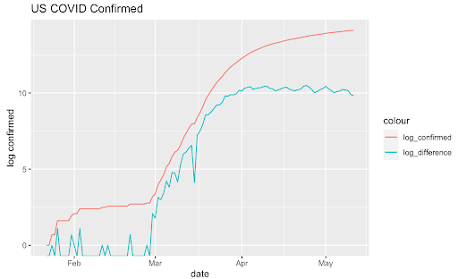
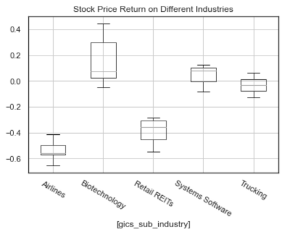

# Introduction

{width=1300px}

There are so many consequences of the Coronavirus Pandemic, mostly in a bad way. It gives direct strike to not only the economy itself, rather, our daily life.

# Visualization

{width=1200px}

{width=1000px}

{width=1200px}

We first started to take a look with its stock data. We retrieved the daily stock price data of S&P 500 companies from Yahoo Finance and calculated how much return of investment each industry had on average. As we can see, the airline industries had a huge negative return of investment, while having a small variance compared to other industries for which we suspected to be correlated with physical distancing and reduced mobility. On the graph on the left hand side, we plotted how the mobility and stock prices had been changing in the last three months, and we figured that they had a very similar trend. 
 

{width=1200px}

Most of the airline companies are acting in the same way, so we picked United Airline which has the highest correlation with COVID impact. We predicted its stock price and revenue and observed unnatural depreciation as soon as it became 2020. Google trend data revealed international travel has decreased for 70% and domestic flight has decreased for average 40%, obviously due to the social distancing and rapid worldwide spread of COVID-19. After investigating COVID impact on airline companies and LAX, we sought for alternative strategies on how airline companies make profit.

{width=1200px}

{width=1200px}

To make it clear, we simplified the total passenger count of the left hand side. Middle plot illustrates the scaled count of cargo transported and aircraft operations in total. Due to the seasonality, cargo has its lowest points during the February, but it bounced back to it's usual routine in March some way. From the effect of social distancing and decreased industrial activity, cargo is also somewhat decreased compared with previous years. But for the aircraft operations, counts have drastically decreased ever since the pandemic arises. This made air-freight fees to be more expensive than usual. Oil prices are currently at their lowest point, so airline companies are using passenger aircraft as a cargo carrier to make some profit but this is still not enough for them.

# Conclusion
Our analysis suggests that the biggest collapse in terms of stock return and revenue was airline industry 1 with showing the large gap between its actual and predicted values.  The high correlation between workplace mobility and stock price of airline industries has led the further analysis of the airport passenger count and social distancing. A strong negative correlation between the airport passenger count and social distancing value at its peak point 1 proposes that travel count as explained by the airport passenger count 1 increases as the social distancing value shows its decreasing trend after its peak.  The rise in the demand in cargo with the reduction in the flight operation and its passenger count implies the airline companies are replacing the passengers with the air-freights. 

# References
Github link : https://github.com/dunnohow/Datafest2020/tree/master/data/airline yfinance: https://pypi.org/project/yfinance/  covid19py: https://pypi.org/project/COVID19Py/  Google trend: https://trends.google.com/trends/?geo=US  Cargo & Aircraft Operations: https://www.lawa.org  Stock Data: http://shiny.stat.ucla.edu:3838/c183c283/  Jet Fuel Price: https://www.iata.org/en/publications/economics/fuel-monitor/  10-Q: https://www.sec.gov  Mobility: https://www.google.com/covid19/mobility/  COVID-19 data:https://coronavirus.jhu.edu/map.html
